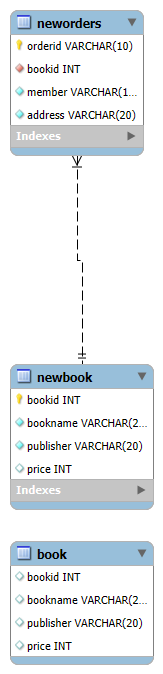
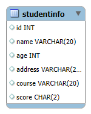
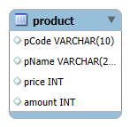
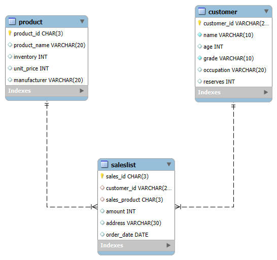

# 📚 SeSAC_Database_Study

## 📖 소개

SeSAC Database Study 레포지토리는 MySQL을 사용하여 SQL을 학습한 내용을 담고 있습니다.  
데이터 정의 언어(DDL), 데이터 조작 언어(DML), 다양한 SQL 함수 및 명령어와 같은 기본적인 SQL 개념을 다룹니다.
Python 언어를 사용하여 Database와의 연결 및 각종 적용을 담고 있습니다. 


### 학습 내용

| 구분                | 학습 내용                                                                                                                                   |
|---------------------|---------------------------------------------------------------------------------------------------------------------------------------------|
| **데이터베이스 기본 문법 학습**  | SQL의 DDL, DML, WHERE, ORDER BY, 집계함수, GROUP BY, DISTINCT, UPDATE, DELETE, ALTER, 기본키, 외래키, NULL, JOIN, 문자열/날짜/수학 관련 내장함수 등을 학습. |
| **데이터베이스 연결 학습**      | Python을 활용한 데이터베이스 연결, 선택, 삽입, 수정, 삭제, 매개변수 활용 방법 학습.                                                                 |
| **실습 과제**               | CREATE, SELECT, WHERE, ORDER BY, 수학 함수, 종합예제 등 다양한 SQL 실습 및 Python을 활용한 데이터베이스 연결 실습 진행.                                      |


## 🛠️ 기술 스택

|<center>MySQL</center>|
|--|
|<p align="center"></p>| 
||

## 📂 Directory Structure

```plaintext
SeSAC_Database_Study/
├── README.md 
├── .env
├── icons/
│   └── MySQL-Dark.svg
├── docs/
│   ├── 01_SQL_Basic(DDL_DML).sql
│   ├── 02_SQL_Basic(WHERE).sql
│   ├── 03_SQL_Basic(Order_By).sql
│   ├── 04_SQL_Basic(Aggregate_Function).sql
│   ├── 05_SQL_Basic(Group_By).sql
│   ├── 06_SQL_Basic(DISTINCT).sql
│   ├── 07_SQL_Basic(UPDATE).sql
│   ├── 08_SQL_Basic(DELETE).sql
│   ├── 09_SQL_Basic(ALTER).sql
│   ├── 10_SQL_Basic(PrimaryKey).sql
│   ├── 11_SQL_Basic(ForeignKey).sql
│   ├── 12_SQL_Basic(NULL).sql
│   ├── 13_SQL_Basic(JOIN).sql
│   ├── 14_SQL_Basic(BuiltIn_CHAR).sql
│   ├── 15_SQL_Basic(BuiltIn_DATE).sql
│   ├── 16_SQL_Basic(BuiltIn_MATH).sql
│   ├── BookDB_ERD.png
|   ├── StudentDB_ERD.png
|   ├── ShopDB_ERD.png
│   └── quest/
│       ├── quest1_SQL_basic(Create_Select).sql
│       ├── quest2_SQL_basic(WHERE).sql
│       ├── quest3_SQL_basic(ORDERBY).sql
│       ├── quest4_SQL_basic(MATH).sql
│       ├── quest5_SQL_basic(TOTAL).sql
│       ├── quest6_SQL_basic(tourDB).sql
│       ├── quest7_SQL_basic(LevelUP).sql
│       ├── quest8_SQL_basic(BuiltInFunction).sql
│       ├── quest9_SQL_connection_01.py
│       ├── quest10_SQL_connection_02.py
│       └── quest11_SQL_PMP.py
└── connect_with_python/
    ├── connection_select.py
    ├── connection_insert.py
    ├── connection_update.py
    ├── connection_delete.py
    └── connection_parameters.py

```

## 📊 ERD Diagram






## 💻 Database File

<details open>
<summary>Database Basic File</summary>

|번호|구분|파일|설명|비고|
|--|--|--|--|--|
|01|SQL_Basic|[01_SQL_Basic(DDL_DML)](./docs/01_SQL_Basic(DDL_DML).sql)|SQL DDL, DML 학습||
|02|SQL_Basic|[02_SQL_Basic(WHERE)](./docs/02_SQL_Basic(WHERE).sql)|SQL WHERE문 학습||
|03|SQL_Basic|[03_SQL_Basic(Order_By)](./docs/03_SQL_Basic(Order_By).sql)|SQL ORDER BY 학습||
|04|SQL_Basic|[04_SQL_Basic(Aggregate_Function)](./docs/04_SQL_Basic(Aggregate_Function).sql)|SQL 집계함수 학습||
|05|SQL_Basic|[05_SQL_Basic(Group_By)](./docs/05_SQL_Basic(Group_By).sql)|SQL GROUP BY 학습||
|06|SQL_Basic|[06_SQL_Basic(DISTINCT)](./docs/06_SQL_Basic(DISTINCT).sql)|SQL 중복내용 삭제 학습||
|07|SQL_Basic|[07_SQL_Basic(UPDATE)](./docs/07_SQL_Basic(UPDATE).sql)|SQL UPDATE 학습||
|08|SQL_Basic|[08_SQL_Basic(DELETE)](./docs/08_SQL_Basic(DELETE).sql)|SQL DELETE 학습||
|09|SQL_Basic|[09_SQL_Basic(ALTER)](./docs/09_SQL_Basic(ALTER).sql)|SQL ALTER 학습||
|10|SQL_Basic|[10_SQL_Basic(PrimaryKey)](./docs/10_SQL_Basic(PrimaryKey).sql)|SQL 기본키 학습||
|11|SQL_Basic|[11_SQL_Basic(ForeignKey)](./docs/11_SQL_Basic(ForeignKey).sql)|SQL 외래키 학습||
|12|SQL_Basic|[12_SQL_Basic(NULL)](./docs/12_SQL_Basic(NULL).sql)|SQL NULL 학습||
|13|SQL_Basic|[13_SQL_Basic(JOIN)](./docs/13_SQL_Basic(JOIN).sql)|SQL 2개 이상 테이블 조회 학습||
|14|SQL_Basic|[14_SQL_Basic(BuiltIn_CHAR)](./docs/14_SQL_Basic(BuiltIn_CHAR).sql)|SQL 문자열관련 내장함수 학습||
|15|SQL_Basic|[15_SQL_Basic(BuiltIn_DATE)](./docs/15_SQL_Basic(BuiltIn_DATE).sql)|SQL 날짜관련 내장함수 학습||
|16|SQL_Basic|[16_SQL_Basic(BuiltIn_MATH)](./docs/16_SQL_Basic(BuiltIn_MATH).sql)|SQL 수학관련 내장함수 학습||
</details>

<details open>
<summary>Database Connection File</summary>

|번호|구분|파일|설명|비고|
|--|--|--|--|--|
|01|Connection|[connection_select.py](./connect_with_python/connection_select.py)|데이터베이스 연결 및 출력 학습||
|02|Connection|[connection_insert.py](./connect_with_python/connection_insert.py)|데이터베이스 연결 및 추가 학습||
|03|Connection|[connection_update.py](./connect_with_python/connection_update.py)|데이터베이스 연결 학습 및 수정 학습||
|04|Connection|[connection_delete.py](./connect_with_python/connection_delete.py)|데이터베이스 연결 학습 및 삭제 학습||
|05|Connection|[connection_parameters.py](./connect_with_python/connection_parameters.py)|데이터베이스 매개변수 활용 학습||

</details>

### 📈 QUEST

<details open>
<summary>Database Basic QUEST</summary>

|번호|구분|파일|설명|비고|
|--|--|--|--|--|
|01|SQL|[quest1_SQL_basic(Create_Select)](./docs/quest/quest1_SQL_basic(Create_Select).sql)|CREATE, SELECT 실습||
|02|SQL|[quest2_SQL_basic(WHERE)](./docs/quest/quest2_SQL_basic(WHERE).sql)|SQL WHERE문 실습||
|03|SQL|[quest3_SQL_basic(ORDERBY)](./docs/quest/quest3_SQL_basic(ORDERBY).sql)|SQL ORDER BY 실습||
|04|SQL|[quest4_SQL_basic(MATH)](./docs/quest/quest4_SQL_basic(MATH).sql)|SQL MATH관련 실습||
|05|SQL|[quest5_SQL_basic(TOTAL)](./docs/quest/quest5_SQL_basic(TOTAL).sql)|SQL 종합예제 실습||
|06|SQL|[quest6_SQL_basic(tourDB)](./docs/quest/quest6_SQL_basic(tourDB).sql)|관광데이터 포털 DATA를 활용한 실습|
|07|SQL|[quest7_SQL_basic(LevelUP)](./docs/quest/quest7_SQL_basic(LevelUP).sql)|SQL 종합예제 실습||
|08|SQL|[quest8_SQL_basic(BuiltInFunction).sql](./docs/quest/quest8_SQL_basic(BuiltInFunction).sql)|SQL 내장함수 실습||
|09|SQL|[quest9_SQL_connection.py](./docs/quest/quest9_SQL_connection.py)|Python을 활용한 Database 연결 실습|가격이 1,000원 ~ 2,000원 사이 제품 검색|
|10|SQL|[quest10_SQL_connection _02.py](./docs/quest/quest10_SQL_connection_02.py)|Python을 활용한 Database 연결 실습2|가격이 2,000원 미만인 제품들의 평균가와 수량의 합을 계산|
|11|SQL|[quest11_SQL_PMP.py](./docs/quest/quest11_SQL_PMP.py)|재고 관리 시스템 만들기 실습|||
</details>

## 📝참고자료

## 👩‍💻설치모듈
```
~$ pip install PyMySQL
```
